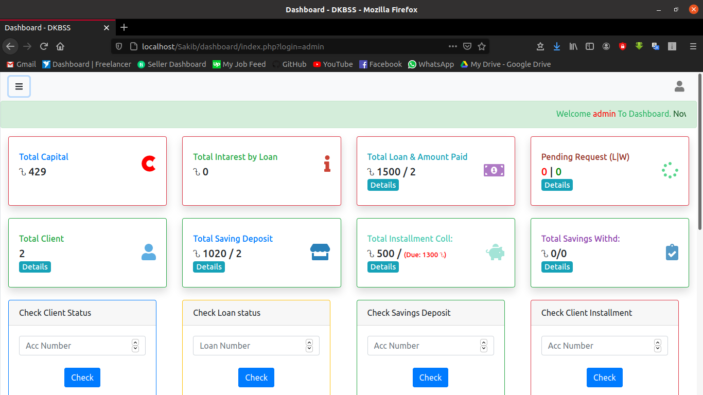
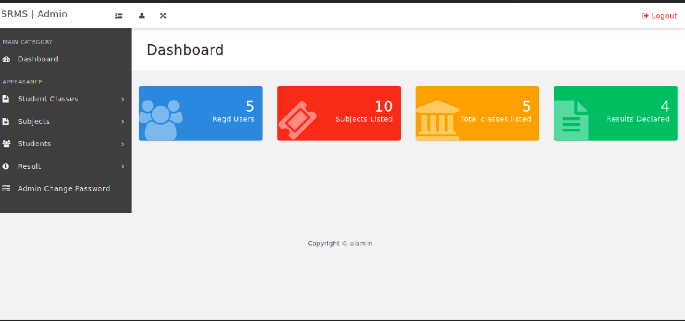
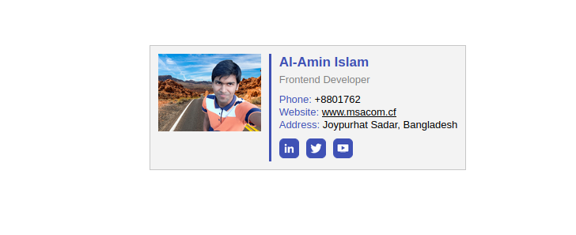

<!DOCTYPE html>
<html>
<title>Person Website </title>
<meta charset="UTF-8">
<meta name="viewport" content="width=device-width, initial-scale=1">
<link rel="stylesheet" href="https://www.w3schools.com/w3css/4/w3.css">

<body class="w3-content" style="max-width:1300px">

<!-- First Grid: Logo & About -->

  

    

      <h1>Personal Website</h1>
    

    

      <a href="#" class="w3-button w3-black w3-block w3-hover-blue-grey w3-padding-16">Home</a>
      <a href="#work" class="w3-button w3-black w3-block w3-hover-teal w3-padding-16">My Work</a>
      <a href="#work" class="w3-button w3-black w3-block w3-hover-dark-grey w3-padding-16">Resume</a>
      <a href="#contact" class="w3-button w3-black w3-block w3-hover-brown w3-padding-16">Contact</a>
    

  

  

    

      <h1>About Me</h1>
      
      

        

            Hello, I'm 

            Md Al-Amin Islam Sakib  
            
            I'm a Student. Studying Computer Engineering on Dinajpur Polytechnic Institute(2017-18). 

            
            Technical Skill :
            •Python •C# •Java •HTML •CSS •SQL •JavaScript •Wordpress •MS-Office •Linux 

            
            Hobbies :
            •Software Engineer.

        

           <a href="https://web.facebook.com/msacom.tk"><i class="fa fa-facebook-official" aria-hidden="true" style="width:6%" ></i></a> 
           <a href="https://github.com/msasakibalamin"> <i class="fa fa-github" aria-hidden="true"  style="width:6%"></i></a>
           <a href="https://www.instagram.com/msa_sakib_alamin/?fbclid=IwAR0A89ek9MkMAEo_Ydv3htVNrHeeNVOhbN3BoeYyELkZe5dGkKlK0jCHCB4"><i class="fa fa-instagram" aria-hidden="true"  style="width:6%"></i></a>
           <a href="https://twitter.com/msasakibalamin"><i class="fa fa-twitter" aria-hidden="true"  style="width:6%"></i></a> 
            <a href="https://www.linkedin.com/in/al-amin-5222661a4/"><i class="fa fa-linkedin-square" aria-hidden="true"></i>
            </a>

      

    

  

  

<!-- marquee System -->

<marquee scrollamount="3">
     Welcome   To Personal Website. Now <b id="today"></b>. Date Format : Month - Day -Year
 </marquee> 

<!-- Second Grid: Work & Resume -->

  

    

      <h2>My Work</h2>
      
Some of my latest projects.

    

    

      

        
      

      

        
      

    

    

      

       
      

      

        
      

    

    

      

        
      

      

        
      

    
 
    
Just call me awesome.

  

  

    

      <h2>Resume</h2>
      
A draft from my CV

      

        <table class="w3-table">
          <tr>
            <th>Year</th>
            <th>Title</th>
            <th>Where</th>
          </tr>
        
          
          <tr class="w3-white">
            <td>2017-2018</td>
            <td>Diploma in Engineering (Study)</td>
            <td>Dinajpur, Dhaka, Bangladesh</td>
          </tr>
          <tr>
            <td>2015-2016</td>
            <td>Secondary School Certificate (SSC)</td>
            <td>Shyampur High School, Joypurhat</td>
          </tr>
          <tr class="w3-white">
            <td>2014</td>
            <td>Junior School Certificate (JSC)</td>
            <td>Shyampur High School, Joypurhat</td>
          </tr>
          <tr class="w3-hide-medium">
            <td>2011</td>
            <td>Primary School Certificate (PSC)</td>
            <td>Shyampur Government Primary School, Joypurhat</td>
          </tr>
        </table>
      

    

  

<!-- Third Grid: Swing By & Contact -->

  

    

      <h1>Swing By</h1>
    

    

      
..For a cup of coffee, or whatever..

      
Joypurhat Sadar, Bangladesh

      
+88 01762868864

      
msasakibalamin0@gmail.com

    

  

  

    

      <h1>Contact</h1>
      
GET IN TOUCH

      <form class="w3-container w3-card w3-padding-32 w3-white" action="/action_page.php" target="_blank">
        

          <label>Name</label>
          <input class="w3-input" style="width:100%;" type="text" required name="Name">
        

        

          <label>Email</label>
          <input class="w3-input" style="width:100%;" type="text" required name="Email">
        

        

          <label>Message</label>
          <input class="w3-input" style="width:100%;" type="text" required name="Message">
        

        <button type="submit" class="w3-button w3-teal w3-right">Send</button>
      </form>
    

  

<!-- Footer -->
<footer class="w3-container w3-black w3-padding-16">
  
&#169; <a href="https://msainfo.tk" target="_blank">Al-Amin</a>

 

 
</footer>

</body>

</html>
